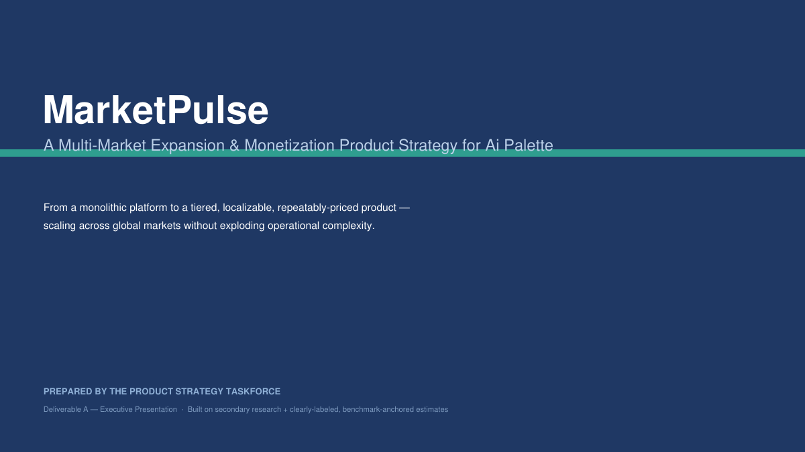
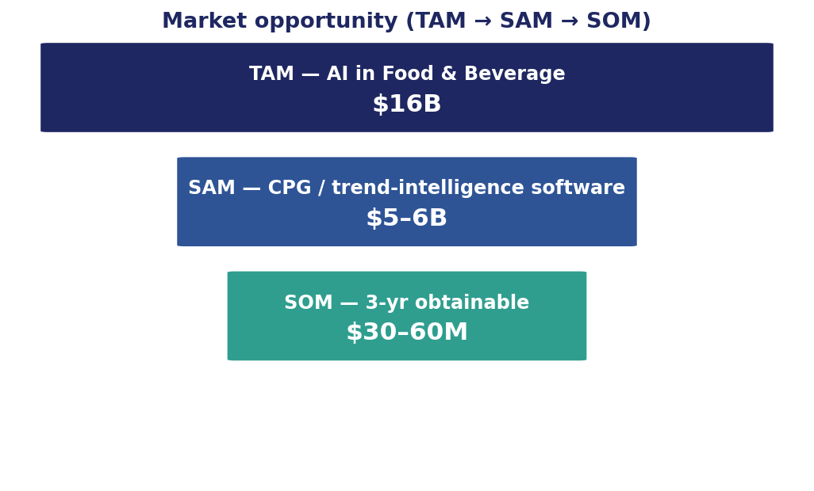
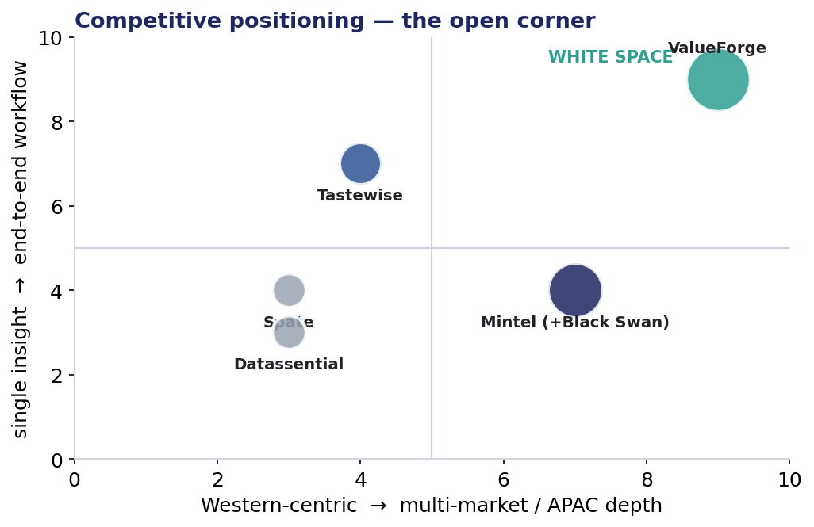
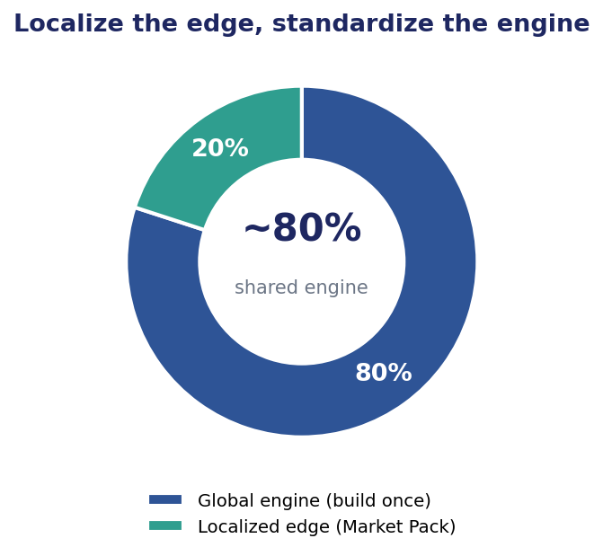
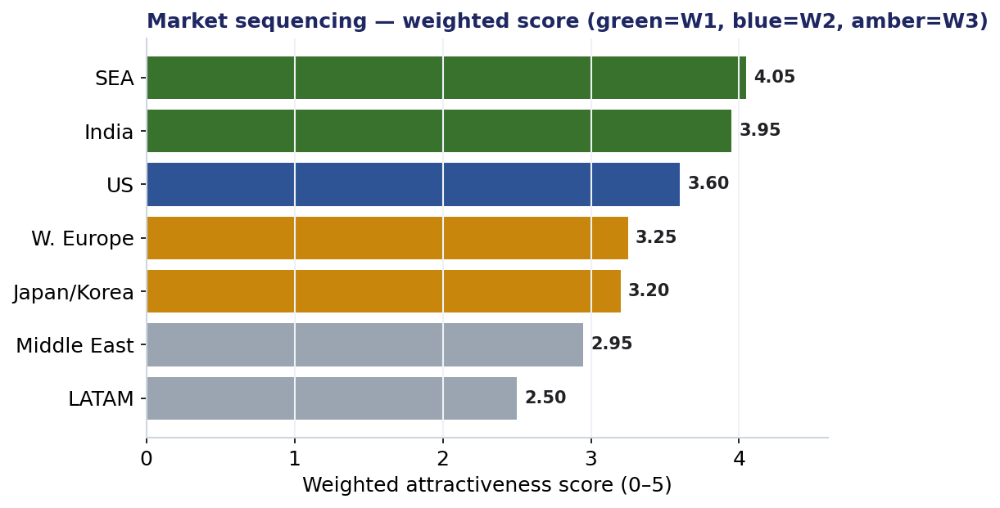
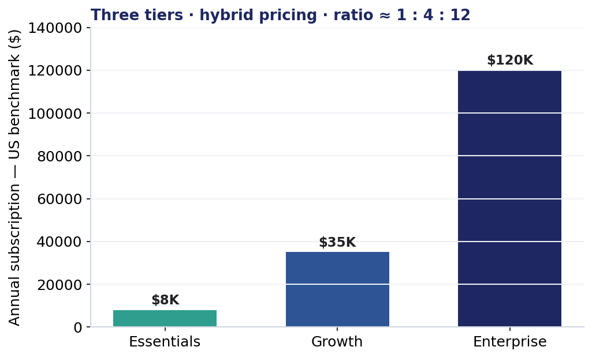
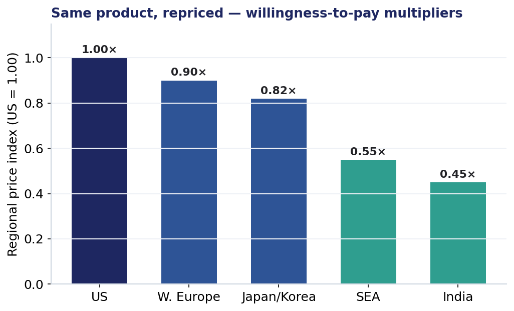
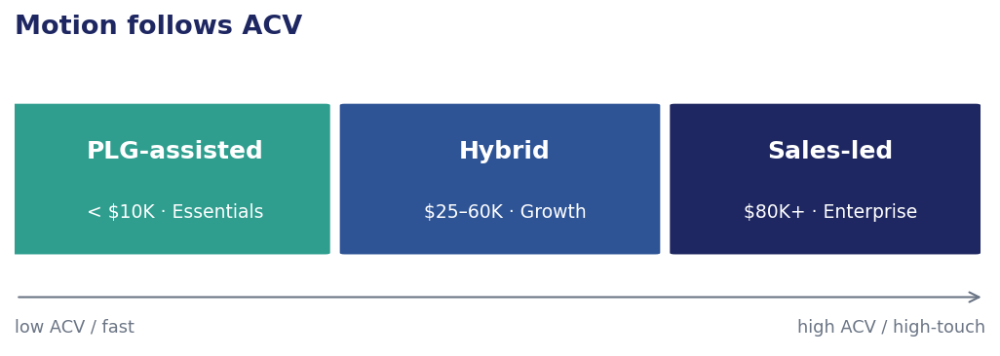
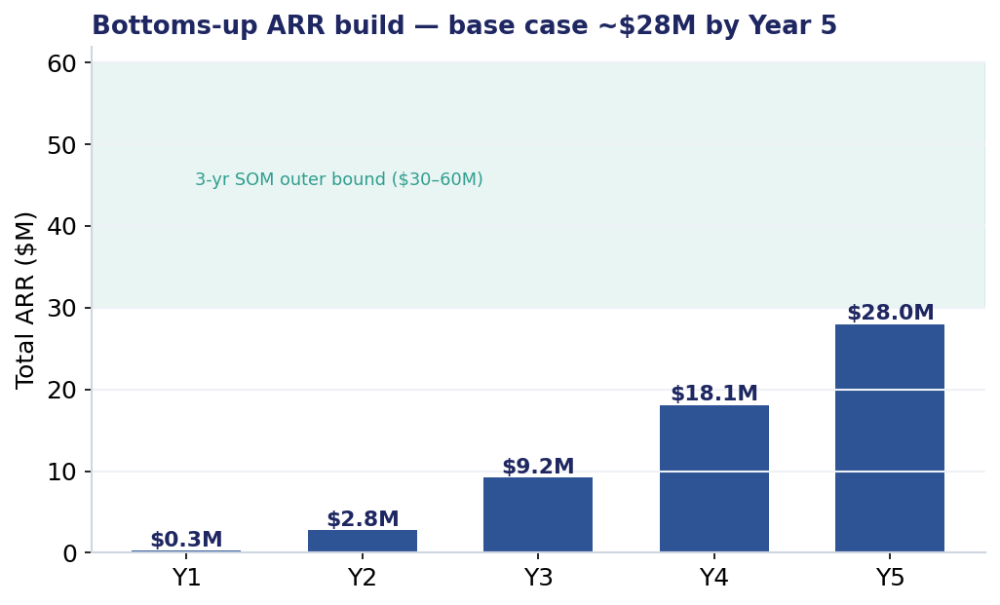
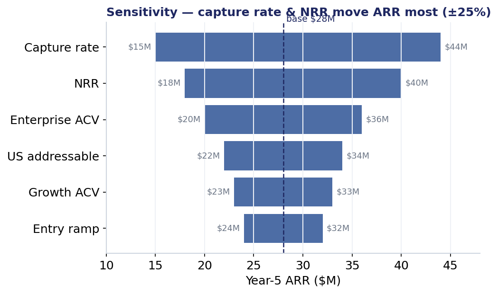

<div align="center">

# 🌐 MarketPulse

### Ai Palette — Multi-Market Expansion & Monetization Strategy



*Moving a monolithic AI-insights platform to a **tiered, localizable, repeatably-priced** product — built to scale across global markets without exploding operational complexity.*


### 🔗 Open it live — no download needed

[](https://market-pulse-nine-rho.vercel.app)

[](https://view.officeapps.live.com/op/view.aspx?src=https%3A%2F%2Fraw.githubusercontent.com%2Fnightraven4545%2FMarketPulse%2Fmain%2Fdeliverables%2FDeliverableA_Executive_Presentation.pptx)
[](deliverables/DeliverableA_Executive_Presentation.pdf)
[](https://raw.githack.com/nightraven4545/MarketPulse/main/dashboard/index.html)
[](https://raw.githack.com/nightraven4545/MarketPulse/main/wireframe/index.html)

[](https://view.officeapps.live.com/op/view.aspx?src=https%3A%2F%2Fraw.githubusercontent.com%2Fnightraven4545%2FMarketPulse%2Fmain%2Fdeliverables%2FDeliverableA_ValueForge_Product_Strategy_Deck.pptx)
[](https://view.officeapps.live.com/op/view.aspx?src=https%3A%2F%2Fraw.githubusercontent.com%2Fnightraven4545%2FMarketPulse%2Fmain%2Fdeliverables%2FMarketPulse_Strategy_Memo.docx)
[](https://view.officeapps.live.com/op/view.aspx?src=https%3A%2F%2Fraw.githubusercontent.com%2Fnightraven4545%2FMarketPulse%2Fmain%2Fdeliverables%2FDeliverableB_Commercial_Architecture.xlsx)
[](deliverables/MarketPulse_Judges_CheatSheet.pdf)

**[📊 Full deliverables index](DELIVERABLES.md) · [📈 ARR Model](arr-model/) · [🧠 Decision Science](decision-science/)**

</div>

---

## Visual preview

<table>
<tr>
<td width="33%"><br/><sub><a href="docs/07-market-sequencing.md">TAM → SAM → SOM funnel</a></sub></td>
<td width="33%"><br/><sub><a href="docs/08-competitive-benchmark.md">Competitive positioning 2×2</a></sub></td>
<td width="33%"><br/><sub><a href="docs/03-phase1-localization-matrix.md">Standardize vs. localize split</a></sub></td>
</tr>
<tr>
<td width="33%"><br/><sub><a href="docs/07-market-sequencing.md">Market sequencing — weighted scores</a></sub></td>
<td width="33%"><br/><sub><a href="docs/05-phase2-pricing-packaging.md">Three-tier pricing structure</a></sub></td>
<td width="33%"><br/><sub><a href="docs/05-phase2-pricing-packaging.md">Regional willingness-to-pay</a></sub></td>
</tr>
<tr>
<td width="33%"><br/><sub><a href="docs/06-phase2-gtm-onboarding.md">GTM motion vs. deal size (ACV)</a></sub></td>
<td width="33%"><br/><sub><a href="docs/10-arr-model-methodology.md">Bottoms-up ARR build, Y1–Y5</a></sub></td>
<td width="33%"><br/><sub><a href="docs/10-arr-model-methodology.md">ARR sensitivity (tornado)</a></sub></td>
</tr>
<tr>
<td width="33%"><br/><sub><a href="docs/11-decision-science.md">MDP-optimal entry sequence</a></sub></td>
<td width="33%"><br/><sub><a href="docs/11-decision-science.md">SHAP-style score explainability</a></sub></td>
<td width="33%" align="center"><sub>↳ all charts are <a href="assets/">native PNGs in <code>assets/</code></a>, embedded in the deck + dashboard, not screenshots</sub></td>
</tr>
</table>

---

**Prepared by:** Product Strategy Taskforce  ·  **Subject:** [Ai Palette](https://www.aipalette.com/) — AI-powered consumer-insights & product-innovation platform (Singapore, ~$13.5M raised; customers incl. Nestlé, Danone, Kellogg's, Cargill, Olam).

> **Status / disclaimer:** Conceptual strategy from secondary research + clearly-labeled assumptions. Ai Palette is **private** — no audited financials or SEC filings exist, so every figure here is an *estimate anchored to public benchmarks* ([audit trail →](docs/02-assumptions-and-data-sources.md)).

---

## What is MarketPulse?

**MarketPulse is a multi-market expansion and monetization strategy case study for [Ai Palette](https://www.aipalette.com/)**, a Singapore-based AI consumer-insights and product-innovation platform. The repo answers four questions with quantified, source-traceable frameworks: **what to standardize vs. localize**, **how to package features into pricing tiers**, **how to price by market**, and **which go-to-market motion to use** — backed by a Markov Decision Process (MDP) for market sequencing, a SHAP-style explainability layer for scoring, and a bottoms-up ARR model (**≈$9.2M Year 3 / $28M Year 5**). It includes an executive presentation, a commercial-architecture workbook, a consulting strategy memo, an interactive dashboard, and a clickable product wireframe — all built from public benchmarks, not Ai Palette's internal data. **Try it live:** the entire case is deployed as an interactive web app at **[market-pulse-nine-rho.vercel.app](https://market-pulse-nine-rho.vercel.app)** — no install required.

## Live interactive web app

**▶ Live demo: [market-pulse-nine-rho.vercel.app](https://market-pulse-nine-rho.vercel.app)**

The whole strategy is also a deployed, interactive product — a **Next.js** web app (TypeScript, Tailwind CSS, Recharts) hosted on **Vercel**. Nothing to install:

| Section | What you can do |
|---------|-----------------|
| [**Dashboard**](https://market-pulse-nine-rho.vercel.app/dashboard) | Explore market-attractiveness scores, the TAM → SAM → SOM funnel, the competitive-positioning 2×2, the localize-vs-standardize split, tiered pricing, regional willingness-to-pay, and the 3-wave roadmap. |
| [**ARR Model**](https://market-pulse-nine-rho.vercel.app/arr-model) | Drag the assumptions on a live bottoms-up ARR calculator and watch every chart (build, new-vs-expansion, tornado sensitivity) recompute instantly. Base case ≈ $9.2M Year 3 / $28M Year 5. |
| [**Decision Science**](https://market-pulse-nine-rho.vercel.app/decision-science) | Run an interactive Markov Decision Process (MDP) market-entry sequencer and re-weight a SHAP-style score explainer in the browser. |
| [**Strategy**](https://market-pulse-nine-rho.vercel.app/strategy) | Read the full written case — 11 chapters with a chapter navigator. |
| [**Deliverables**](https://market-pulse-nine-rho.vercel.app/deliverables) | View or download the executive deck, commercial-architecture workbook, ARR model, strategy memo, and one-page cheat sheet. |

Run it locally with `cd web && npm install && npm run dev`.

## FAQ

**What problem does MarketPulse solve?**
It prevents the two failure modes of market expansion: over-localizing a product (engineering bloat, slow rollout) and under-localizing it (lost deals, poor product-market fit). It does this by explicitly scoring what must be localized vs. kept global, market by market.

**What is Ai Palette?**
Ai Palette is an AI-powered consumer-insights and product-innovation platform headquartered in Singapore, with ~$13.5M raised and customers including Nestlé, Danone, Kellogg's, Cargill, and Olam. It is the real-world subject this case study is built around.

**Is this Ai Palette's actual internal strategy?**
No. Ai Palette is privately held with no public financials, so every number in this repo is an *estimate anchored to public benchmarks* and clearly labeled as such — see the [assumptions and data sources audit trail](docs/02-assumptions-and-data-sources.md).

**What pricing model does MarketPulse recommend?**
A hybrid model: a platform subscription as the anchor, usage/credit-based billing (e.g., AI concept-generation runs, markets, categories), and seats as an expansion lever — three tiers (*Essentials*, *Growth*, *Enterprise*) mapped to buyer maturity and deal size.

**What is the recommended market entry sequence?**
Wave 1: deepen Southeast Asia and India. Wave 2: enter the United States (highest willingness-to-pay). Wave 3: EU and Middle East. The sequence is generated by a scored rubric and an MDP solver, not a qualitative guess.

**What technical methods does this use?**
A Markov Decision Process (MDP) for optimal market-entry sequencing under uncertainty, a SHAP-style explainability layer to justify each market's score, and a bottoms-up ARR model with sensitivity (tornado) analysis — see [`decision-science/`](decision-science/) and [`arr-model/`](arr-model/).

**Who is this repo for?**
Product strategists, GTM/RevOps teams, and consultants studying multi-market SaaS expansion, tiered pricing design, or localization-vs-standardization tradeoffs — and anyone evaluating this as a portfolio case study.

**Is there a live demo of MarketPulse?**
Yes. A fully interactive web app is deployed on Vercel at **[market-pulse-nine-rho.vercel.app](https://market-pulse-nine-rho.vercel.app)**. It includes the solution dashboard, a live ARR model you can drive with sliders, the MDP + SHAP decision-science tools, the full written strategy, and downloadable deliverables — no sign-up or install required.

**What is MarketPulse built with?**
The interactive web app is built with Next.js (App Router), TypeScript, Tailwind CSS, and Recharts, and is deployed on Vercel. The standalone ARR model is a Python/Streamlit app; the MDP solver and SHAP-style explainer are plain Python (NumPy + Matplotlib); and the underlying data lives in machine-readable CSVs under [`frameworks/`](frameworks/).

---

## The problem in one line
Entering new markets with one undifferentiated product over-localizes everything (engineering bloat) or under-localizes (lost deals). MarketPulse defines **exactly what to standardize vs. localize, how to package it into tiers, how to price it per market, and which sales motion delivers it** — then wraps that in a repeatable decision engine.

## What's in this repo

| Path | What it is |
|------|-----------|
| [`docs/01-context-and-problem.md`](docs/01-context-and-problem.md) | Business context, the expansion blind spot, scope |
| [`docs/02-assumptions-and-data-sources.md`](docs/02-assumptions-and-data-sources.md) | **Every estimate is traceable here** — sources + estimation method |
| [`docs/03-phase1-localization-matrix.md`](docs/03-phase1-localization-matrix.md) | Phase 1 — what stays global vs. what gets localized |
| [`docs/04-phase1-feature-tiering.md`](docs/04-phase1-feature-tiering.md) | Phase 1 — Essentials / Growth / Enterprise tier logic |
| [`docs/05-phase2-pricing-packaging.md`](docs/05-phase2-pricing-packaging.md) | Phase 2 — pricing model, packaging, willingness-to-pay |
| [`docs/06-phase2-gtm-onboarding.md`](docs/06-phase2-gtm-onboarding.md) | Phase 2 — PLG vs. sales-led motion & onboarding |
| [`docs/07-market-sequencing.md`](docs/07-market-sequencing.md) | Scored market prioritization & 3-wave entry plan |
| [`docs/08-competitive-benchmark.md`](docs/08-competitive-benchmark.md) | Competitor benchmark, positioning 2×2, market structure, consolidation signal |
| [`docs/09-strategy-memo.md`](docs/09-strategy-memo.md) | **Consulting strategy memo** (SCQA + Pyramid Principle + frameworks) — markdown source |
| [`docs/10-arr-model-methodology.md`](docs/10-arr-model-methodology.md) | **Bottoms-up ARR model** methodology, defaults, base case & sensitivity |
| [`docs/11-decision-science.md`](docs/11-decision-science.md) | **MDP** entry-sequencing + **SHAP-style** score explainability (the rigorous core) |
| [`workflow/market-entry-automation.md`](workflow/market-entry-automation.md) | The **automated market-entry decision engine** (rubric + flow) |
| [`docs/12-valueforge-prd.md`](docs/12-valueforge-prd.md) | **ValueForge PRD** (Deliverable B) — product requirements + user flow |
| [`dashboard/index.html`](dashboard/index.html) | **Interactive solution dashboard** — [open live ↗](https://raw.githack.com/nightraven4545/MarketPulse/main/dashboard/index.html) (Chart.js visualizations) |
| [`wireframe/index.html`](wireframe/index.html) | **ValueForge interactive wireframe** (Deliverable B) — [open live ↗](https://raw.githack.com/nightraven4545/MarketPulse/main/wireframe/index.html), clickable brand-manager flow |
| [`arr-model/`](arr-model/) | **Interactive ARR model** — Streamlit app (`streamlit run app.py`) with tornado + live MDP |
| [`decision-science/`](decision-science/) | **MDP solver + SHAP-style explainer** (Python; generates the decision plot & policy chart) |
| [`DELIVERABLES.md`](DELIVERABLES.md) | **Master index** of every deliverable mapped to the brief |
| [`frameworks/`](frameworks/) | Machine-readable CSVs: localization, tiering, pricing, market scoring, competitor benchmark |
| [`deliverables/`](deliverables/) | The four graded outputs (see below) |

## The deliverables
- **Deliverable A — Executive Presentation** — rich editable **PowerPoint** (`deliverables/DeliverableA_Executive_Presentation.pptx`, 17 slides, embedded data-viz) + PDF: market sequencing, pricing & packaging, standardization↔localization trade-offs, with quantified charts (TAM funnel, competitor 2×2, localization split, market scores, pricing, regional WTP, ARR build, tornado, SHAP, MDP).
- **Deliverable B — Commercial Architecture** (`deliverables/DeliverableB_Commercial_Architecture.xlsx`): 8-tab workbook with **live formulas** mapping tiers × markets × localized features × monetization, plus the decision engine.
- **Consulting Strategy Memo** (`deliverables/MarketPulse_Strategy_Memo.docx`): McKinsey/BCG-style narrative — SCQA, Pyramid Principle, 3C, Porter, Ansoff, value chain, GE-McKinsey, risk register, 90-day plan.
- **Interactive Solution Dashboard** (`dashboard/index.html`): structured, filterable visualizations — market scores, TAM/SAM/SOM, positioning 2×2, localization split, pricing, GTM, and the 3-wave roadmap.
- **ARR Model** — interactive **Streamlit app** (`arr-model/app.py`, now with a tornado sensitivity chart + a live MDP cold-start slider) + matching **Excel model** (`deliverables/DeliverableC_ARR_Model.xlsx`, live formulas). Base case ≈ **$9.2M Y3 / $28M Y5 ARR**.
- **ValueForge Product Strategy Deck** — editable **PowerPoint** (`deliverables/DeliverableA_ValueForge_Product_Strategy_Deck.pptx`, native charts) + PDF: 9-slide consultant-style deck — problem, target user, differentiation logic & consumer-resonance mapping, with quantified visuals.
- **ValueForge PRD + Wireframe** (`docs/12-valueforge-prd.md` + `wireframe/index.html`): requirements and a clickable brand-manager flow ending in a decision-ready strategy brief.
- **Judge's Cheat Sheet** (`deliverables/MarketPulse_Judges_CheatSheet.pdf`): the entire story on one page.

See **[`DELIVERABLES.md`](DELIVERABLES.md)** for the full index mapped to the brief.

## Headline recommendations (TL;DR)
1. **Localize the thin edge, standardize the engine.** Keep the AI/ML core, data pipeline, and concept-generation global; localize only the data *sources*, language/NLP, taxonomy, compliance, and GTM workflow. ~80% of code stays shared.
2. **Three tiers** — *Essentials* (self-serve trend discovery), *Growth* (insights + concepts), *Enterprise* (end-to-end + localization + workflow integration) — mapped to enterprise maturity.
3. **Hybrid pricing**: platform subscription (anchor) + usage/credits (Concept Genie runs, markets, categories) + seats as an expansion lever. Pure per-seat is fading; hybrid posts the highest growth in 2025 benchmarks.
4. **Motion follows ACV**: PLG-assisted for Essentials (ACV <$10K), sales-led for Enterprise (ACV >$25K, committee buying). Hybrid in between.
5. **Sequence**: Wave 1 deepen SEA + India (home advantage), Wave 2 attack US (highest willingness-to-pay), Wave 3 EU + Middle East. Driven by the scoring rubric, not gut feel.

## Run it locally

**Live app:** [market-pulse-nine-rho.vercel.app](https://market-pulse-nine-rho.vercel.app) · **Source:** [github.com/nightraven4545/MarketPulse](https://github.com/nightraven4545/MarketPulse)

```bash
git clone https://github.com/nightraven4545/MarketPulse.git
cd MarketPulse

# 1) the interactive web app (Next.js) — the live site
cd web && npm install && npm run dev      # → http://localhost:3000

# 2) the ARR model (Python / Streamlit)
cd ../arr-model && pip install -r requirements.txt && streamlit run app.py

# 3) the decision-science engine (MDP + SHAP)
cd ../decision-science && pip install -r requirements.txt
python mdp_sequencing.py && python explain_scores.py
```

The web app is deployed on **Vercel** with the project **Root Directory** set to `web`; every push to `main` redeploys automatically.

See [`docs/02`](docs/02-assumptions-and-data-sources.md) for the disclaimer to keep visible to evaluators: *numbers are illustrative, defensible estimates — not company-reported figures.*
