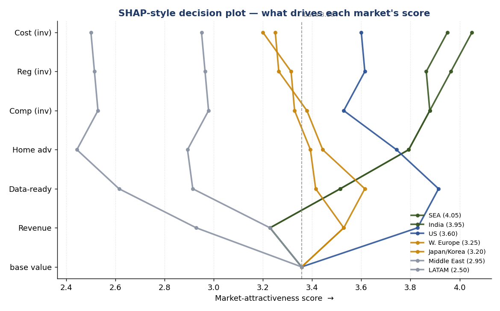
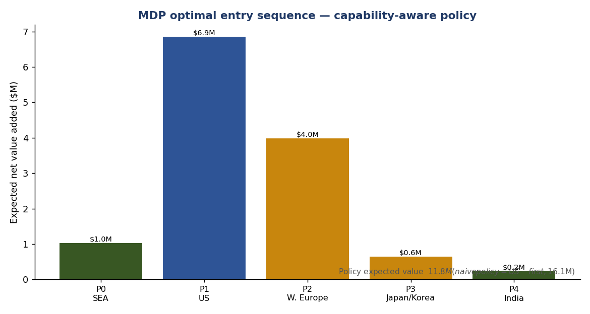

# 11 — Decision Science: MDP sequencing + SHAP-style explainability

> The brief's hint resources — **Markov Decision Process** and **SHAP decision plots** — signal
> that the "automated workflow" should be *quantitatively rigorous and explainable*, not a black
> box. This doc shows how both are now wired into MarketPulse, and what they tell us. Runnable
> code: [`decision-science/`](../decision-science/).

## Were they used before? Not explicitly — now they are.
Our market-entry engine was already a *sequential decision under uncertainty* (Wave 1→2→3) with a
*weighted scoring model*. We formalize the first as an **MDP** and make the second **explainable
with exact Shapley values**. Both validate (and stress-test) the recommended strategy.

---

## A. SHAP-style explainability of the market score
The attractiveness score is an **additive weighted model**: `score(m) = Σ wᵢ · xᵢ(m)`. For
additive models the Shapley value is exact and closed-form:

```
φᵢ(m) = wᵢ · ( xᵢ(m) − mean_i )      and      score(m) = base + Σ φᵢ(m),   base = Σ wᵢ·mean_i
```

So we get a genuine SHAP decomposition **without the shap library** — and we can say so, which is
itself a sophistication point. Outputs:

- `assets/decision_plot.png` — SHAP-style **decision plot**: each market is a line rising from the
  base value, bending left/right as each criterion adds/subtracts, ending at its final score.
- `decision-science/outputs/waterfall_*.png` — per-market waterfalls (what pushes a market up vs. down).
- `decision-science/outputs/shap_contributions.csv` — the exact numbers.

**What it reveals:** US is dragged from the top by *Home-advantage* and *Competition* despite the
strongest *Revenue* contribution; SEA/India win on *Data-readiness* + *Home-advantage*. This is
exactly why the blended score ranks SEA/India above the US — now transparent, not asserted.



---

## B. Market entry as a Markov Decision Process
We model sequencing formally:

| MDP element | MarketPulse meaning |
|---|---|
| **State** | (period *t*, set of markets already established) |
| **Action** | attempt to enter one not-yet-entered market (or wait) |
| **Transition** | attempt succeeds with prob *pₘ* (uncertainty); reuse synergies lower cost (US compliance → W. Europe; Japan partner model → Middle East) |
| **Reward** | expected discounted recurring ARR − entry cost |
| **Policy** | the optimal entry order, from value iteration (backward induction) |

Solved two ways (`decision-science/mdp_sequencing.py`):

- **Scenario A — naïve (risk-neutral):** optimal order = **US → W. Europe → Japan/Korea → SEA → India**
  (V₀ ≈ $16.1M). A pure expected-value model says "go where the money is, first."
- **Scenario B — capability-aware [recommended]:** apply a *cold-start penalty* — entering a hard
  market (US/EU/Japan) with **no reference logos or proven local motion yet** is much riskier.
  Optimal order flips to **SEA → US → W. Europe → Japan/Korea → India** (V₀ ≈ $11.8M).



### The insight (this is the valuable part)
The naïve MDP rushes the US; the moment you price in the **real risk of going cold** (no
references, unproven sales motion, capital concentration), the optimum **lands a cheap home win
first, then attacks the US** — precisely the Wave-1-then-US logic in [`07`](07-market-sequencing.md).
So the MDP doesn't just decorate the strategy; it explains *why* deepening SEA/India first is
risk-adjusted-optimal, and it quantifies the cost of getting sequencing wrong (~$4M of expected
value swings on the cold-start assumption alone — a number worth de-risking with references).

### How this upgrades the automated engine
The engine in [`workflow/market-entry-automation.md`](../workflow/market-entry-automation.md) gets two
rigorous cores: **(1)** the SHAP decomposition makes step-2 *Score* explainable to stakeholders;
**(2)** the MDP makes step-3 *Decide* an optimal *policy* under uncertainty, not a static rule —
re-solve as `pₘ`, costs, or synergies change.

## Run it
```bash
cd decision-science
pip install -r requirements.txt
python explain_scores.py     # SHAP-style plots + CSV
python mdp_sequencing.py     # MDP scenarios A & B + chart
```

## Caveats (intellectual honesty)
All `pₘ`, values, costs and the cold-start penalty are illustrative, benchmark-anchored
assumptions (Ai Palette is private). The point is the *method and the sensitivity*, not the
decimal places — change the inputs and the policy updates.
